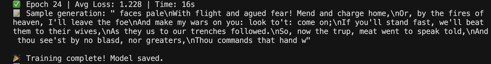
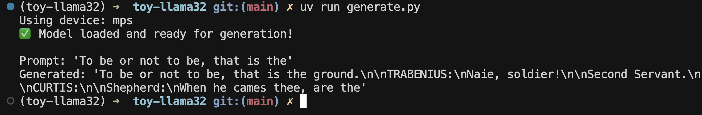
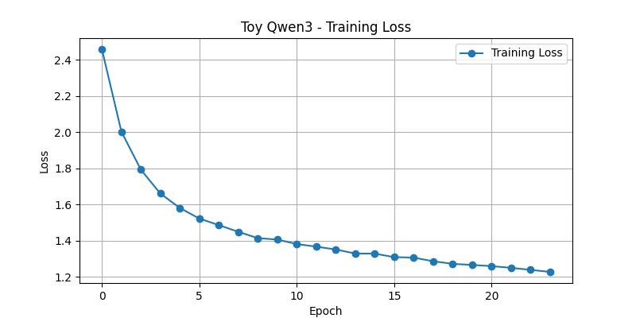

# 🧠 Toy LLaMA 3.2 - Character-Level LLM

A **toy implementation of the LLaMA 3.2 architecture** for learning purposes. This project trains a character-level language model using a simplified version of the LLaMA 3.2 transformer architecture. The model learns to generate Shakespeare-like text based on input prompts.

> ⚠️ **Disclaimer**: This project is for **educational purposes only**. It is a minimal and experimental implementation. There might be inaccuracies, oversights, or suboptimal decisions. Please feel free to open issues or share suggestions!

---

## ✨ Features

* Character-level tokenizer
* Configurable transformer architecture (LLaMA 3.2-inspired)
* Grouped Query Attention + RoPE frequency interpolation
* Loss plotted and saved over training epochs
* Generation script with support for temperature sampling
* MPS (Mac) and CUDA GPU support with `autocast` context

---

## 📈 Training Results

Trained for **24 epochs** on Shakespeare dataset (char-level) using MPS device. Final training loss: **\~1.228**.

### 🔹 Training Output



### 🔹 Generated Text



### 🔹 Loss Curve



---

## 🛠️ Usage

### 1. Train the model

```bash
uv run train.py
```

### 2. Generate text

```bash
uv run generate.py
```

---

## 📁 Directory Structure

```
toy-llama3/
│
├── src/
│   └── toy_llama/
│       └── layers.py       # Layer components
│       └── model.py        # Model architecture
├── assets/
│   └── loss_curve_24epochs.png
│
├── train.py                 # Training loop
├── generate.py              # Text generation
├── char_vocab.json          # Character-level vocab
├── toy_llama3_24epochs.pth  # Trained model weights (gitignored)
├── README.md
└── .gitignore
```

---

## 🧾 Resources

This project was inspired and guided by:

* 📘 Blog Post: *"The Big LLM Architecture Comparison"* – \[https://magazine.sebastianraschka.com/p/the-big-llm-architecture-comparison]
* 📓 Jupyter Notebook: *"LLaMA 3.2 From Scratch"* – \[https://github.com/rasbt/LLMs-from-scratch/blob/main/pkg/llms_from_scratch/llama3.py]

---

## 🙏 Acknowledgements

Thanks to the open-source community for resources and ideas. Special thanks to Meta and the LLaMA team for releasing their architecture and inspiring learning projects like this.

---

## 📌 Notes

* The model weights (`*.pth`) are excluded from the repo.
* Results may vary based on training duration and device.
* The implementation prioritizes readability and learning over efficiency.